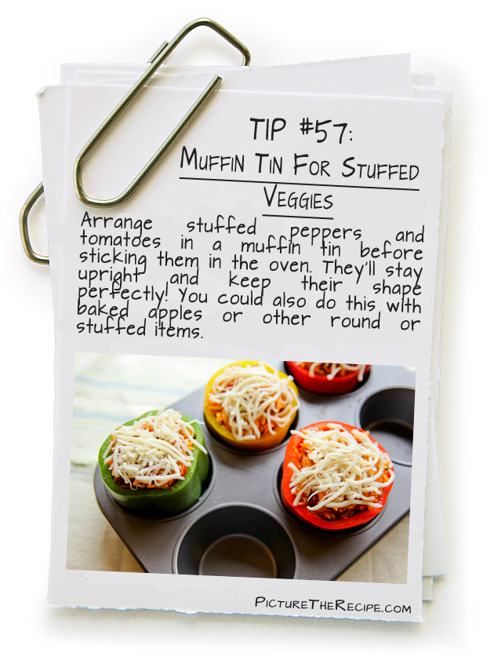

HTML:
Introduction

Structure

Extra Markup

# HTML5 Layout

# ___________________

# Traditional Vs New HTML Layouts

1. Traditional :
used `
` elements

2. New: HTML5 introduces a new elements 

# Some of HTML5 New Layout Elements:

## 1.Headers & Footers 

`<header> <footer>`

## 2.Navigation

`<nav>`

## 3.Articles

`<article>`

## 4. Asides

`<aside>`

## 5.Sections
`<section>`

# HTML5 elements :

The new elements provide clearer code .
 Older browsers that do not understand HTML5
elements need to be told which elements are
block-level elements

# Process & Design

## Some important tools:

# __________________

# 1.Who visits your website?

The tool used to track what kind of visitors are coming to the website because They can influence design decisions from color
palettes to level of detail in descriptions.

# 2. Site Maps

* What needs to appear
on the site, you can start to organize the
information into sections or pages.

# 3. WireFrames

A wireframe is a simple sketch of the key
information that needs to go on each page of a
site. It shows the hierarchy of the information
and how much space it might require.

# Visual hierarchy

Visual hierarchy refers to the order in which your eyes perceive what
they see. It is created by adding visual contrast between the items being
displayed. Items with higher contrast are recognized and processed first.

JavaScript

Introduction

The ABC of Programming

# What is a script?

* A script is a series of instructions that a computer can follow step-by-step to achieve a goal. 

* You could compare scripts to : RECIPES , HANDBOOKS, MANUALS .

# How do I creat a Script?

 

## 1: DEFINE THE GOAL

To write a script, you need to first state your goal and then list the tasks that need to be completed in order to achieve it. 

## 2: DESIGN THE SCRIPT

You can use flowcharts to work out how the tasks fit together. The flowcharts show the paths between each step.

 

3: CODE EACH STEP

   

# EXPRESSIONS

  An expression results in a single value. There are two types of expressions:
   

### 1.EXPRESSIONS THAT JUST ASSIGN A VALUE TO A VARIABLE: 

 

`var color = 'beige' ;`

### 2.EXPRESSIONS THAT USE TWO OR MORE VALUES TO RETURN A SINGLE VALUE:

 

`var area = 3 * 2;`

# OPERATORS 
Expressions rely on operators to calculate a value.

 

### 1.ASSIGNMENT OPERATORS

`color = 'beige';`

### 2.ARITHMETIC OPERATORS

`area = 3 * 2;`

### 3.STRING OPERATORS

`greeting= 'Hi 1' + 'Mol ly'`

### 4.COMPARISON OPERATORS

`buy = 3 > 5;`

### 5.LOGICAL OPERATORS

`buy= (5 > 3) && (4>2);`

  
