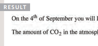

 
 <h1>  <b> TEXT </b>    </h1> 

# When creating a web page, you add TAGS 

## Tags known as: **MARKUPS**

## This chapter will cover **Text Markups**
  
***
 

## 1. **Structural markup:**

### Allow browsers to show users the appropriate structure for the page. It describes the structure of page .

 

## 2. **Semantic markup:**

### Doesn't affect the structure of web pages . Provides extra information and meaning and description of content .

# -------------------------------------

# Structural markups :

 

## 1.Headings

* HTML has six "levels" of
headings 

* `<h1> <h2> .....<h6>`
* `<h1>` : main headings
* `<h2>` : subheadings

 

## 2.Paragraphs
  `
 your paragraph ..... 
`
* browser will show
each paragraph on a new line
with some space between it and
any following paragraphs.

 

## 3. Bold 

 * `text <b> bold texts... </b> text`
 * Make characters appear bold.
 * Used for Keywords 
* Does not imply
any additional meaning.

  

## 3. Italic

 * `text <b> bold texts... </b> text`
 * Make characters appear bold.
 * Used for 
   - Technical terms
   - Names of ships,
   - Foreign words

 

## 4. Super-script and Sub-script
  
  * ## Superscript 
  * ` The 4th of October`
  * Contain characters slightly **above** the normal line 
   * suffixes of dates or mathematical concepts like (power)

  * ## Subscript 

   * ` The H2O`
  * Contain characters slightly **below** the normal line 
   * Chemical formulas such as H20 

    

 

# White Space 

## What's White Space?

* a Text composed only of spaces, tabs or line breaks 

 

## What's White space collapsing?
* browser completely **ignore** white spaces .

* **Two or more spaces** next to each
other ----> only **one space displayed** 

* **linevbreak** ----> only **one space displayed** 

* ## **Makes code easier to read** 

# result:

 

## 5.Line Breaks and Horizontal Rules

* ` ` Add a line break inside the
middle of a paragraph 
* `
` add a ruler . Used as a break .

  
  

# Empty elements 
* elements that
do not have words between
an opening and closing tag.
* Like ` ,   , 
`
* **GOOD PRACTICE** : add space and a forward slash 
like : 
* `  same as  ` 

   

# 2. **Semantic markup:**

* ## Purpose : **Describe the content** of your web pages 

 

* ## **Shouldn't** use them to **change** the way that your text looks .

 

* ## **WHY?** : Used for programs like screen readers or search engines .

 

 * ## **HOW?** They use the extra information. For example: 
- ### voice of a screen reader may add emphasis to the words inside the <em> 
- ### search engine might register that the page has a quote if you use the <blockquote> 

 

  

## 1.Strong & Emphasis
* `<strong> </strong>`
* indicates that 
content has strong importance

* will show
the contents in bold 

 

* `<em> </em>`
* Changes
the meaning of a sentence (depending on what word 
in the sentence is Italic).

* will show
the contents in italic 

 

  

## 1.Qoutations 

### used for marking up quotations:
* `<blockquote> </blockquote>`
* used for longer quotes that **take
up an entire paragraph**.

* `
` tag still used inside .
* it  indent the paragraph (push it away . adds a margin)

 

* `<q>  </q>`

*  used for
shorter quotes 

*  most browsers put quotes around
the content 

 

 

## 2.Abbreviations & Acronyms  
* `<abrr> </abbr>`
* Used for Abbriviations (eg. Doctor - Dr ) and Acronyms (eg. USA - United States of America) 

* It shows a description when you mouse over the element.
* Needs "title=" attribute .

## 3.Citations & Definitions 
* `<cite> </cite>`
* Used when mentioning a book name, movie, name of a published paper 
* content will appear italic 
* `<cite>A Brief History of Time</cite> by Stephen
 Hawking has sold over... `

 

  * `<dfn> </dfn>`
  * Used when defining new term 
  * `A <dfn>black hole</dfn> is a region of space`

  

## 4.Author Details  
 * contain
contact details for the author of
the page (his address, email, phone number).

* `<address>  742 Evergreen Terrace, Springfield.</address>`

  

## 5.Changes to Content

  * `<ins>  </ins>` 
  * used
to show content that has been
inserted into a document
* appears Underlined

 

* `<del>  </del>`

* to show deleted text 
* appears with a line crosssing though it 

 

* `<s>  </s>`
*  indicates
something that is no longer
accurate or relevant
* appears with crossed line

  

 <h1>  <b> CSS</b>    </h1> 
 

# What Does CSS Do?

## CSS allows you to create **rules** that specify how the **content of an element should appear** .

 

# How CSS works?

## The key to understanding how CSS works is to imagine that there is an **invisible box around every HTML element** .

 

## BLOCK & INLINE ELEMENTS
Every HTML element has a default display value, depending on what type of element it is.
  

There are two display values: block and 
  

* **Block level elements** : 
* always start on a new line . 
* Takes up the full width available . 
* Has default TOP and BOTTOM Margin (16px) .
*  `<h1>-<h6>, 
 and 
` 

 

* **Inline elements**: 
* Does not start on a new line (flow within the
text)
* only takes up as much width as necessary.
* doesn't have a default margin .
 
* `<b>, <i>, , <em> and `

 

# Style Rules
## * These rules govern how element's content should be displayed. 

 

## * A CSS rule contains two parts: 
## 1.**selector**: indicate which element the rule applies to .

## 2.**declaration**: how the selected elements should be styled.

 

##  **Declarations**  sit inside curly brackets and each is made up of two parts: a property and a value, separated by a colon

 

 

