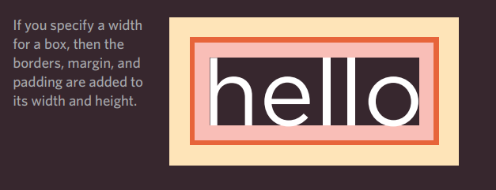

# Lists 

There are three types of HTML lists: ordered,
unordered, and definition. 

# Ordered Lists 
* Ordered lists use numbers.
* Each item in the list is
numbered. 

* created withthe `<ol>` element.

* Each item in the list is placed
like this :  `<li> item1 </li>` 

* The li stands for **"list item"** 

# Unordered Lists

* Unordered lists use bullets.
* Items begin with a bullet point
(rather than characters that indicate order).

* created withthe `<ul>` element.

* Each item in the list is placed
like this :  `<li> item1 </li>` 

# Definition Lists  

*  Used to define terminology.
*  consists of a series of terms and
their definitions.

*  created with `<dl>` element .

*   `<dt> Term1 </dt>`  used to contain the term
being defined

* `<dd> definition1 </dd>` used to contain the
definition.

# Nested Lists

* Also called "Sub-lists" 
* add a list inside `<li>` element .
* Browsers display nested lists
indented further than the parent
list. 
* browser will change
the style of the bullet .

# CSS BOXES 

# Boxes Dimentions

*  use height and
width properties.

*  use pixels, percentages, or
ems. 

* pixels: allow accurately control  size. 

* percentages : size of the box is relative to
 browser window size or size of the containing box.

 * percentage and ems are flexible
with different-sized screens.

# Overflowing Content

    The overflow property tells the
browser what to do if the content
contained within a box is larger
than the box itself. It can have
one of two values:
* hidden 

* scroll

# Border, Margin & Padding

## Every box has three available properties that can be adjusted to control its appearance: 

## 1.Border

Every box has a border (even if
it is not visible or is specified to
be 0 pixels wide). The border
separates the edge of one box
from another.

## 2.Margin

Margins sit outside the edge
of the border. You can set the
width of a margin to create a
gap between the borders of two
adjacent boxes.

# 3.Padding

Padding is the space between
the border of a box and any
content contained within it.
Adding padding can increase the
readability of its contents.

# Border 

1. border-width
3. border-style 
5. border-color
4. Shorthand
border : The border property allows you
to specify the width, style and
color of a border in one property
(and the values should be coded
in that specific order).

## Centering Content :

If you want to center a box on
the page (or center it inside
the element that it sits in):

1. set the left-margin and
right-margin to auto.

 
2. set a width or the box (otherwise it will take
up the full width of the page).

3. In order for this to work in older
browsers, the
element that the box sits inside
should have a text-align
property set to
center.

# CSS3 Border images 

## border-image

1: The URL of the image
2: Where to slice the image
3: What to do with the straight
edges; the possible values are:
 stretch stretches the image
 repeat repeats the image
 round like repeat but if the
tiles do not fit exactly, scales
the tile image so they will

