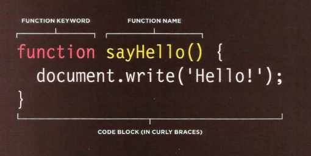
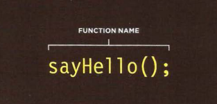
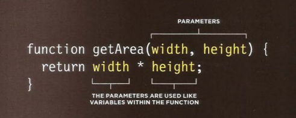
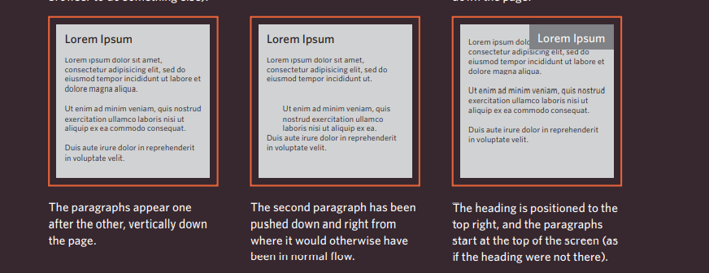
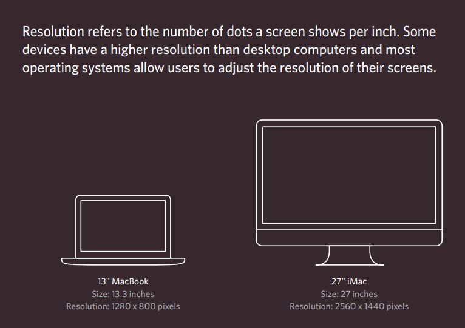

 
 
 
 
 
 # Links
 
 Links are the defining feature of the web
because they allow you to move from
one web page to another — enabling the
very idea of browsing or surfing.

# Types of links:
* Links from one website to another
* Links from one page to another on the same website
* Links from one part of a web page to another part of the
same page
* Links that open in a new browser window
* Links that start up your email program and address a new
email to someon
 

 # Writing Links

 
 Links are created using the `<a>` element. Users can click on anything
between the opening `<a> tag and the closing </a> `tag. 

* You specify
which page you want to link to using the href attribute.

# Directory Structure

On larger websites it's a good idea to organize your code by placing the
pages for each different section of the site into a new folder. Folders on a
website are sometimes referred to as directories.

Each sub-directory contains:
● A file called index.html which
is the homepage for that
section

# Email Links 

## mailto:

To create a link that starts up
the user's email program and
addresses an email to a specified
email address, you use the `<a>`
element. However, this time the
value of the href attribute starts
with mailto: and is followed by
the email address you want the
email to be sent to.

   
 
 
 
 # Linking to a Specific Part of the Same Page 

 To link to an element that uses
an id attribute you use the `<a>`
element again, but the value of
the href attribute starts with
the `#` symbol, followed by the
value of the id attribute of the
element you want to link to. In
this example, `<a href="#top">`
links to the `<h1>` element at
the top of the page whose id
attribute has a value of top. 

 
 

 # Functions, Methods, and Objects 

 Browsers require very detailed instructions about what
we want them to do. Therefore, complex scripts can run
to hundreds (even thousands) of lines. Programmers use
functions, methods, and objects to organize their code.
This chapter is divided into three sections that introduce:
1. FUNCTIONS & OBJECTS 
2. BUILT-IN METHODS 
3. OBJECTS
 
    
 

 
# FUNCTION

## WHAT IS A FUNCTION?

###  Functions consist of a series of statements that have been grouped together because they perform a specific task.

 

# Why Do We Use Functions?

### If different parts of a script repeat the same task, you can REUSE the function (rather than repeating the same set of statements) 

 

# Benifits?
> ## 1. Helps organize your code. 

 
 

> ## 2. Store the steps needed to achieve a task until they're they are required. .

  
  

# Function Terminology:

## Declaring Function

   
  
  

    

# Parameters

 

### Some functions need to be provided with information in order to achieve a given task . Pieces of information passed to a function are known as **Parameters**

  

# Calling Function

## When you ask the function to perform a task it's called **calling a function**

  
  
  

    

## Declaring Function That Needs Information 

  
  
  

    

## Calling Function That Needs Information
 
   
  
  

    

# VARIABLE SCOPE 

The location where you declare a variable will affect where it can be used
within your code. If you declare it within a function, it can only be used
within that function. This is known as the variable's scope.
1. LOCAL VARIABLES 

2. GLOBAL VARIABLES 

 

# Layouts

# Key Concepts in Positioning Elements

  ## 1.Building Blocks
CSS treats each HTML element as if it is in its
own box. This box will either be a block-level
box or an inline box.

## 2.Containing Elements
If one block-level element sits inside another
block-level element then the outer box is
known as the containing or parent element

# Controlling the Position of Elements

CSS has the following positioning schemes that allow you to control
the layout of a page:

1. normal flow 
2. relative positioning 
3. absolute positioning. 

You specify the positioning scheme using the position
property in CSS. You can also float elements using the float property.

To indicate where a box should be positioned, you may also need to use
box offset properties to tell the browser how far from the top or bottom
and left or right it should be placed. 

1. Fixed Positioning 

2. Floating Elements

When you move
any element from
normal flow, boxes
can overlap. The
z-index property
allows you to control
which box appears
on top

# Screen Sizes 

Different visitors to your site will have different sized screens that show
different amounts of information, so your design needs to be able to
work on a range of different sized screens.

When designing for print, you
always know the size of the
piece of paper that your design
will be printed on. However,
when it comes to designing for
the web, you are faced with the
unique challenge that different
users will have different sized
screens. 

# Fixed Width Layouts 
Fixed width layout
designs do not
change size as the
user increases
or decreases
the size of their
browser window.
Measurements tend
to be given in pixels

# Liquid layout
Liquid layout designs
stretch and contract
as the user increases
or decreases the
size of their browser
window. They tend to
use percentages.
  
  

# 6 Reasons for Pair Programming

* pair programming commonly involves two roles: the Driver and the Navigator.

*  The Driver is the programmer who is typing and the only one whose hands are on the keyboard.

* The Navigator uses their words to guide the Driver but does not provide any direct input to the computer. The Navigator thinks about the big picture .
Pair programming touches on all four  skills in language learning: 

1. speaking: developers explain out loud what the code should do, 
2. listning :listen to others’ guidance,
3. read code that others have written, 
4. write code themselves.

# Why pair programing is important?

1. Greater efficiency

2. Engaged collaboration
3. Learning from fellow students
4. Social skills
5. Job interview readiness
