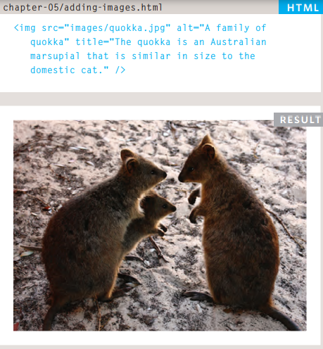
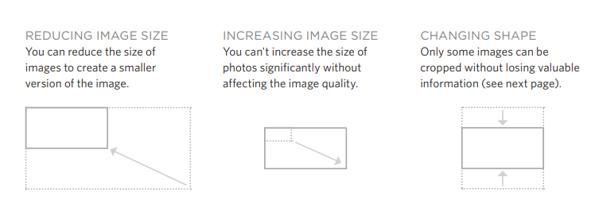

# Images

## Images should...
 1. Be relevant
 2. Convey information
 3. Convey the right mood
 4. Be instantly recognisable
 4. Fit the color palette

# Stock photos 
If you dont have images for your website 

www.istockphoto.com

www.gettyimages.com

www.veer.com

www.sxc.hu

www.fotolia.com

# Storing Images on Your Site 

If you are building a site from scratch, it is good
practice to create a folder for all of the images
the site uses.

 

# Adding Images

To add an image into the page
you need to use an 
element. This is an empty
element .

 

## attributes :
1. src 
2. alt 
3. title

 

# Three Rules for Creating Images

## 1. Save images in the right format

* jpeg, gif, or png format

* wrong image
format then your image might
not look as sharp as it should
and can make the web page
slower to load.

## 2. Save images at the right size

* If the
image is larger than the width
and height if you have specified,
the image will take longer to
display on the page.

* For example, if you have
designed a page to include an
image that is 300 pixels wide by
150 pixels tall, the image you use
should be 300 x 150 pixels. You
may need to use image editing
tools to resize and crop the 

# Image Dimensions

# HTML5: Figure and Figure Caption 

* `<figure>`  contain images and their caption

* `<figcaption>`  add
a caption to an image

## Photographs are best saved as JPEGs; illustrations or logos that use flat colors are better saved as GIFs.

  

# colors

 

# Understanding Color

* Every color on a computer screen is created by mixing amounts of red,
green, and blue. To find the color you want

* Computer monitors are made
up of thousands of tiny squares
called pixels (if you look very
closely at your monitor you
should be able to see them).

## You can use a color picker

[Paletton.com](https://paletton.com/)

 

# Foreground Color (color)

## Specify the color of text inside an element . 

## You can specify any color in CSS in one of three ways:

 

# 1.RGB Values:

### Values for red, green, and blue are expressed as numbers between 0 and 255.

 

### 2.hex-digit codes that

### represent the amount of red,green and blue in a color in hexadecimal code

# 3\. color names

### There are 147 predefined color

names that are recognized
by browsers , they are very limited in number.

 

# Background Color (background-color)

* CSS treats each HTML element
as if it appears in a box, and the
background-color property
sets the color of the background
for that box.

 
* If you do not specify a
background color, then the
background is transparent.

   

# Hue
* Hue is a degree on the color wheel from 0 to 360.

* 0 is red, 120 is green, and 240 is blue

# Saturation
 * refers to the amount of gray in a color. 

* Saturation is a percentage value, 0% means a shade of gray, and 100% is the full color.

# Brightness
* Brightness (or "value") refers to how much black is in a color.

* Lightness is also a percentage value, 0% is black, and 100% is white.

   

# Contrast
When picking foreground and background
colors, it is important to ensure that there is
enough contrast for the text to be easy to read.

  

# CSS3 
# 1.Opacity
## Specify opacity of an element .
( The value is a number between 0.0 and 1.0 )

# 2.rgba() 

## The rgba() function define colors using the Red-green-blue-alpha (RGBA) model.

 
Alpha channel - which specifies the opacity for a color.

 

# HSL
## HSL stands for hue, saturation, and lightness. 

# 1.hsl()
An HSL color value is specified with:
hsla(hue, saturation, lightness)

# 2.hsla()

An HSLA color value is specified with:
hsla(hue, saturation, lightness, alpha)

Alpha channel - which specifies the opacity for a color.

  

# TEXT

# Typeface Terminology

## 1. Serif:
## 2. san-serif
## 3. Monospace
## 4. Cursive
## 5. Fantasy

# Font Properties

## font-family

The font-family property
allows you to specify the
typeface

## font-size

The font-size property enables
you to specify a size for the
font

## font-weight

The font-weight property
allows you to create bold text. values : bold , normal

## font-style
If you want to create italic text, values : normal , italic .

## text-shadow
It is used to create a drop
shadow

# Styling Links :link, :visited

## :link
This allows you to set styles
for links that have not yet been
visited.

## :visited
This allows you to set styles for
links that have been clicked on.

   

# JPEG vs PNG vs GIF — which image format to use and when?

* these 3 formats together comprise of more than 95% of all images loaded on websites.

* images compressed to reduce the size of data and ensure faster transmission

* Use JPEG format for all images that contain a natural scene or photograph where variation in colour and intensity is smooth.

* Use PNG format for any image that needs transparency or for images with text & objects with sharp contrast edges like logos.

*  Use GIF format for images that contain animations.

 

