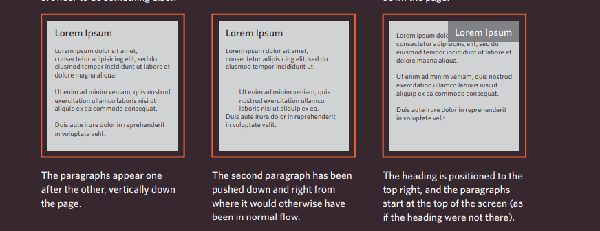
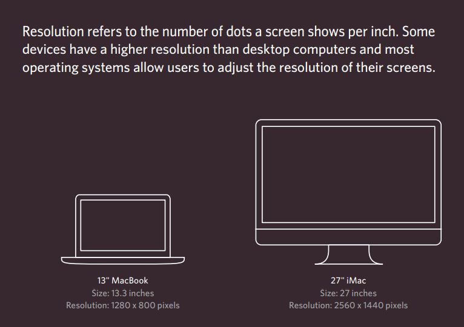

# HTML5 Layout

# ___________________

# Layouts

# Key Concepts in Positioning Elements

  ## 1.Building Blocks
CSS treats each HTML element as if it is in its
own box. This box will either be a block-level
box or an inline box.

## 2.Containing Elements
If one block-level element sits inside another
block-level element then the outer box is
known as the containing or parent element

# Controlling the Position of Elements

CSS has the following positioning schemes that allow you to control
the layout of a page:

1. normal flow 
2. relative positioning 
3. absolute positioning. 

You specify the positioning scheme using the position
property in CSS. You can also float elements using the float property.

To indicate where a box should be positioned, you may also need to use
box offset properties to tell the browser how far from the top or bottom
and left or right it should be placed. 

1. Fixed Positioning 

2. Floating Elements

When you move
any element from
normal flow, boxes
can overlap. The
z-index property
allows you to control
which box appears
on top

# Screen Sizes 

Different visitors to your site will have different sized screens that show
different amounts of information, so your design needs to be able to
work on a range of different sized screens.

When designing for print, you
always know the size of the
piece of paper that your design
will be printed on. However,
when it comes to designing for
the web, you are faced with the
unique challenge that different
users will have different sized
screens. 

# Fixed Width Layouts 
Fixed width layout
designs do not
change size as the
user increases
or decreases
the size of their
browser window.
Measurements tend
to be given in pixels

# Liquid layout
Liquid layout designs
stretch and contract
as the user increases
or decreases the
size of their browser
window. They tend to
use percentages.
  
  

# Traditional Vs New HTML Layouts

1. Traditional :
used `
` elements

2. New: HTML5 introduces a new elements 

# Some of HTML5 New Layout Elements:

## 1.Headers & Footers 

`<header> <footer>`

## 2.Navigation

`<nav>`

## 3.Articles

`<article>`

## 4. Asides

`<aside>`

## 5.Sections
`<section>`

# HTML5 elements :

The new elements provide clearer code .
 Older browsers that do not understand HTML5
elements need to be told which elements are
block-level elements

# Process & Design

## Some important tools:

# __________________

# 1.Who visits your website?

The tool used to track what kind of visitors are coming to the website because They can influence design decisions from color
palettes to level of detail in descriptions.

# 2. Site Maps

* What needs to appear
on the site, you can start to organize the
information into sections or pages.

# 3. WireFrames

A wireframe is a simple sketch of the key
information that needs to go on each page of a
site. It shows the hierarchy of the information
and how much space it might require.

# Visual hierarchy

Visual hierarchy refers to the order in which your eyes perceive what
they see. It is created by adding visual contrast between the items being
displayed. Items with higher contrast are recognized and processed first.

