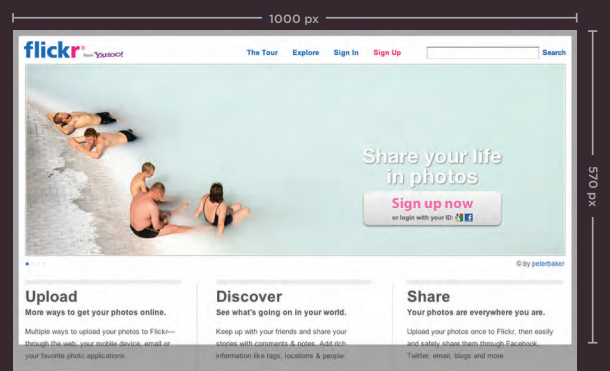

# Layout

 # [Positioning Elements]

- CSS treats each HTML element as if it is in its
own box. 

1. Block-level elements

- start on a new line

- Examples include:
`<h1> 
 <ul> <li>`

2. Inline elements

- flow in between
surrounding text

- Examples include:
` <b> <i>`

 

# [Containing Elements]

- If one block-level element sits inside another
block-level element, the outer box is
known as the containing or parent element.

- like if `
` element used as a header, it will contain the logo , the nav bar , website name .

 

# [positioning schemes]

using :

- float property.
- position property .

- position property

1. Normal flow

- The default behavior of block-level elements 

- appear one after the other, vertically down
the page.

1. Relative Positioning

- moves element with reference to 
**its normal flow**  .

1. Absolute positioning

- moves element with reference to **its container element** .

- elements around it behave as if it doesnt exist .

- moves with scrolling 

1. Fixed Positioning 

- moves element with reference to **browser window** .

- type of absolute positioning

- doesnt move with scrolling 

5. Floating Elements

- position elemebt to the far left or right of a
containing box. 

- other elements flow around it .

 

z-index property
- boxes overlap. 
- control which box appears on top.

 

# [Screen Sizes]

- Different visitors to your site will have different sized screens .

 

# [Screen Resolution]

- number of dots a screen shows per inch.

- adjustable on os .

- higher the resolution, the
smaller the text appears. 

- mobile screens have higher resolution 

 

- [Page Sizes]

- optimal page size is : 960-1000 pixels wide ( based on resolution and screen size now)

- **being “above the fold"** : The area that users
would see without scrolling down .

- users judge if he want to scroll down or not based on this area .

- top 600 pixels of a page .

 

 

# [Fixed and liquid Width Layouts]

- Fixed width layouts :

  - do not
change size as the
user increases
or decreases
the size of their
browser window.

  - Measurements tend
to be given in pixels.

- Liquid width layout:

  - designs
stretch and contract
as the user increases
or decreases the
size of their browser
window. 
  - They tend to
use percentages.

