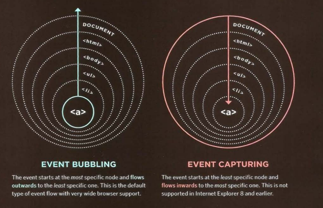

# Events 

## Concept and use of Events?
- browser registers different
types of events
javaScript then respond to these events. 

- Events are the browser's way of indicating when
something has happened 

- (such as when a page has
finished loading or a button has been clicked). 

1. When an event occurs on an element
2. it can trigger a JavaScript function. 
2. When this function then changes
the web page in some way, it **feels interactive becauseit has responded to the user.**

## Terminology

- When an event has occurred, it is often described as having **fired** or been **raised**

- **Binding** is the process of stating which event you are
waiting to happen, and which element you are waiting
for that event to happen upon. (3 ways for binding)

- **event delegation** to monitor for events
that happen on all of the children of an element.

# Event FLow 

The order of how events fire .

- 2 directions of event flow :

1. inwards : event capturing
2. outwards : event bubbling 

# USER INTERFACE EVENTS 

User interface CUI) events occur as a result of interaction with the
browser window 

- load, unload, error, resize ...)

# Where events occure ?

1. Screen 
2. Page 
3. Client 