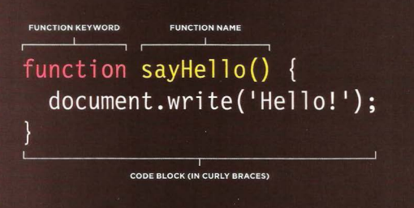
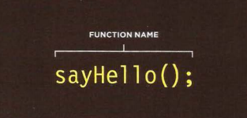
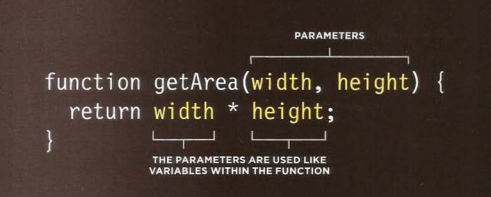
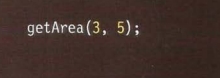

# FUNCTION

## WHAT IS A FUNCTION?

###  Functions consist of a series of statements that have been grouped together because they perform a specific task.

 

# Why Do We Use Functions?

### If different parts of a script repeat the same task, you can REUSE the function (rather than repeating the same set of statements) 

 

# Benifits?
> ## 1. Helps organize your code. 

 
 

> ## 2. Store the steps needed to achieve a task until they're they are required. .

  
  

# Function Terminology:

## Declaring Function

   
  
  

    

# Parameters

 

### Some functions need to be provided with information in order to achieve a given task . Pieces of information passed to a function are known as **Parameters**

  

# Calling Function

## When you ask the function to perform a task it's called **calling a function**

  
  
  

    

## Declaring Function That Needs Information 

  
  
  

    

## Calling Function That Needs Information
 
   
  
  

    
