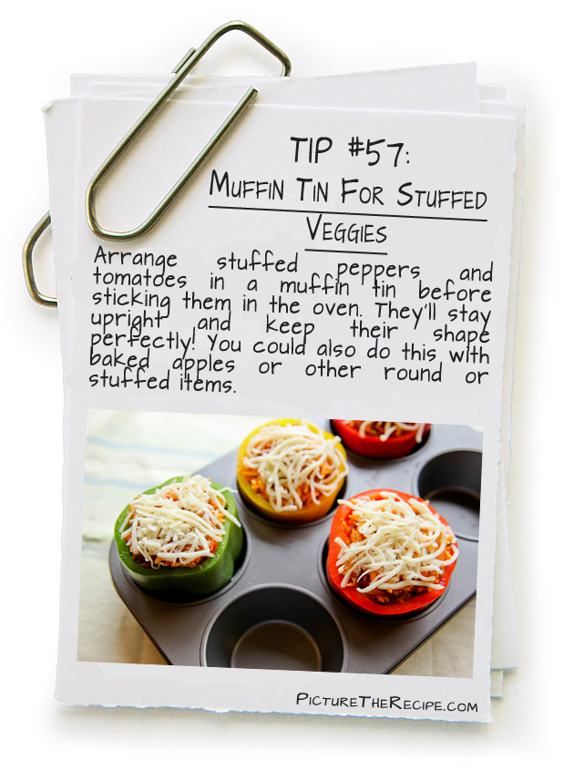

# JavaScript

 

# What is a script?

* A script is a series of instructions that a computer can follow step-by-step to achieve a goal. 

* You could compare scripts to : RECIPES , HANDBOOKS, MANUALS .

# How do I creat a Script?

 

## 1: DEFINE THE GOAL

To write a script, you need to first state your goal and then list the tasks that need to be completed in order to achieve it. 

## 2: DESIGN THE SCRIPT

You can use flowcharts to work out how the tasks fit together. The flowcharts show the paths between each step.

 

3: CODE EACH STEP

   

# EXPRESSIONS

  An expression results in a single value. There are two types of expressions:
   

### 1.EXPRESSIONS THAT JUST ASSIGN A VALUE TO A VARIABLE: 

 

`var color = 'beige' ;`

### 2.EXPRESSIONS THAT USE TWO OR MORE VALUES TO RETURN A SINGLE VALUE:

 

`var area = 3 * 2;`

# OPERATORS 
Expressions rely on operators to calculate a value.

 

### 1.ASSIGNMENT OPERATORS

`color = 'beige';`

### 2.ARITHMETIC OPERATORS

`area = 3 * 2;`

### 3.STRING OPERATORS

`greeting= 'Hi 1' + 'Mol ly'`

### 4.COMPARISON OPERATORS

`buy = 3 > 5;`

### 5.LOGICAL OPERATORS

`buy= (5 > 3) && (4>2);`

  

# FUNCTION
## WHAT IS A FUNCTION?
Functions let you group a series of statements together to perform a specific task.

  
  

# Function Terminology:

## Declaring Function

   
  
  

    

## Calling Function

  
  
  

    

## Declaring Function That Needs Information 

  
  
  

    

## Calling Function That Needs Information
 
   
  
  

    

