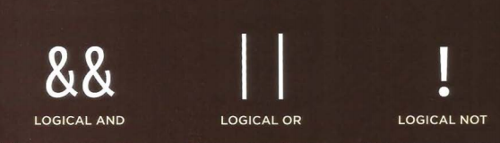

# Comparsion Operators 

## Here are the common comparsion operators in programming:

   

## 1.Less than (<) 

## 2.Greater than (>) 

## 3.Less than or equal to (<=) 

## 4.Greater than or equal to (>=) 

## 5.Equal to (==) 

## 6.Not equal to (!==)

## 7.Strict Equal to (===)

## 8.Strict Not Equal to (!==)

  

# Logical Operators 

## Here are the common Logical operators in programming, they usually return True or False

# 1.|| (Logical OR)

In classical programming, the logical OR is meant to manipulate boolean values only. If any of its arguments are true, it returns true, otherwise it returns false.

# 2.&& ( Logical AND)

In classical programming, AND returns true if both operands are truthy and false otherwise

# 3.! (Logical Not)

* Converts the operand to boolean type: true/false.
* Returns the inverse value.

 
 

# Loops

## 1.For Loop

### Used if you need to run a code  a specific number of times .

## 2.While Loop

### Used if you don't know how many times the code should run.

## 3..Do While 

### Similar to While . It will always run the statement at least once even if the condition is false.

 

# Loop Counters 

For uses counters as a condition, this allows it to run a specified number of times .

## Condition made of 3 statements:
1. Initialization
2. Condition
3. Update
