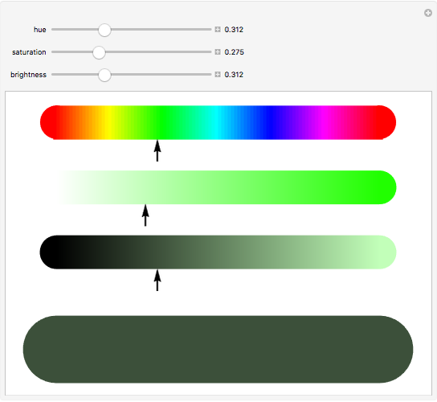

# Understanding Color
* Every color on a computer screen is created by mixing amounts of red,
green, and blue. To find the color you want 

* Computer monitors are made
up of thousands of tiny squares
called pixels (if you look very
closely at your monitor you
should be able to see them).

## You can use a color picker.

[Paletton.com](https://paletton.com/) 

 

# Foreground Color (color)

## Specify the color of text inside an element. 

## You can specify any color in CSS in one of three ways:

 

# 1.RGB Values:

### Values for red, green, and blue are expressed as numbers between 0 and 255.

 

### 2.hex-digit codes that

### represent the amount of red,green and blue in a color in hexadecimal code

# 3.color names

### There are 147 predefined color
names that are recognized
by browsers , they are very limited in number.

   

# Background Color (background-color)

* CSS treats each HTML element
as if it appears in a box, and the
background-color property
sets the color of the background
for that box.

 
* If you do not specify a
background color, then the
background is transparent.

   

# Hue
* Hue is a degree on the color wheel from 0 to 360.

* 0 is red, 120 is green, and 240 is blue

# Saturation
 * refers to the amount of gray in a color. 

* Saturation is a percentage value, 0% means a shade of gray, and 100% is the full color.

# Brightness
* Brightness (or "value") refers to how much black is in a color.

* Lightness is also a percentage value, 0% is black, and 100% is white.

   

# Contrast
When picking foreground and background
colors, it is important to ensure that there is
enough contrast for the text to be easy to read.

  

# CSS3 
# 1.Opacity
## Specify opacity of an element .
( The value is a number between 0.0 and 1.0 )

# 2.rgba() 

## The rgba() function define colors using the Red-green-blue-alpha (RGBA) model.

 
Alpha channel - which specifies the opacity for a color.

 

# HSL
## HSL stands for hue, saturation, and lightness. 

# 1.hsl()
An HSL color value is specified with:
hsla(hue, saturation, lightness)

# 2.hsla()

An HSLA color value is specified with:
hsla(hue, saturation, lightness, alpha)

Alpha channel - which specifies the opacity for a color.

